# Abe-spresso 正式版架构：低写入的 AI 辅助出版系统

日期：2026-09-19。状态：**设计基线，尚未实现或部署**。

本文将用户确认的“三个无数据库权限的 Agent + 一个工作流 + 一个受配额控制的发布器”转化为建设蓝图。当前运行入口仍是根目录 HTML 原型；本文不会使示例新闻变成实时新闻，也不代表已有生产服务。

配套文档：
- [Agent 与工作流契约](AGENT-CONTRACTS.md)：输入输出、状态迁移、失败分支。
- [数据、配额与发布协议](DATA-AND-QUOTAS.md)：D1 结构、预算、并发、用户同步、容量。
- [现有内容契约](../../design/CARD-CONTENT.md)：原文标题、短摘录与日期规则。

## 1. 已确认的产品和资源边界

1. Today / Archive / Saved 不变；每期 12 条，Top 5 + 7。不足 12 条不自动发行、不伪造或悄悄补入旧新闻。
2. 标题、连续短摘录、发布方、真实发布日期和来源链接保留原文；详情新增可选的经批准全文与原文插图（见下节）。不引入 AI 摘要、翻译、价值解读或写稿 Agent。界面双语不等于内容双语。
3. 原型 `2026-09-14` 期号、原路由、存储键 `afi-editorial-prototype-v1` 和品牌资产保持不变。生产日期按独立配置生成，不能覆盖原型日期。
4. D1 为正式内容的权威数据库；公开 HTML / JSON 是可重建的发布副本，不是另一份可自由编辑的主库。
5. D1 账号级硬边界：5,000,000 行读/UTC 日、100,000 行写/UTC 日、5 GB 总存储；即使以后使用付费计划，也不自动提高项目预算。
6. 正常运行预算 4,000,000 行读、80,000 行写；90% 硬额度时冻结常规新增 D1 请求，保留恢复余量。
7. 候选文章、中间评分、模型原始回复、逐步执行状态不进入 D1。只有批准的 12 条和期刊记录可进入内容库；用户状态是另一个受控写入域。
8. 人工批准是第一版必经环节。未实现前，不把本文的目标宣称为线上保障。

### 1.1 详情全文与插图扩展（2026-09-19）

- 前端现已支持可选的结构化原文阅读器，见 [ARTICLE-READER.md](../../design/ARTICLE-READER.md)；当前12条仍为摘录，没有接入第三方全文/原图。
- 采集器在允许转载的来源范围内提取正文、章节、图注、署名和原文插图顺序，生成私有 `article_document` 草稿。公开页面可访问不等于自动具有全文/逐图转载依据。
- 确定性校验比较原文顺序与文本完整性，检查所有媒体的来源和批准状态；不支持的原文结构不得静默丢弃。编辑批准涵盖正文、每张图片的转载依据、署名和内容哈希。
- A/B 的职责与输出不变：筛选、归并、选稿。C 仍只按需复核语义异常，不生成缺失正文/图片，也不认定转载权利。文档提取/资源校验不是第四个 Agent。
- Publisher 将已批准的结构化正文与图片作为不可变内容资源发布，D1 记录版本、资源引用和哈希；模型与普通读者不能直接写入。未批准的抓取 HTML/候选全文仍为限期私有数据。
- 不能展示完整正文时，条目继续以明确的摘录模式发布。正文完整但个别图片缺失时标明缺图，保留位置和图注；不得宣传成包含所有图文的完整复刻。
- 不提高既有 D1 与辅助存储配额。全文/图片扩展需另做容量评估；达到资源预算时停发或提交新的摘录版审批，不悄悄截断正文、压掉图注或扩大预算。

## 2. 总体框架

```mermaid
flowchart LR
  Sources["来源白名单 / RSS / API"] --> Collector["采集与确定性预处理"]
  Schedule["Cron：调度信号"] --> Flow["一个 EditorialWorkflow"]
  Flow --> Collector
  Collector --> Workspace["私有候选包：短期 R2"]
  Workspace --> A["Agent A：筛选与事件归并"]
  A --> B["Agent B：日报选稿"]
  B --> Gate["确定性证据校验"]
  Gate -->|"有歧义"| C["Agent C：异常复核"]
  Gate -->|"合格"| Review["编辑批准：绑定内容哈希"]
  C -->|"复核结果再校验"| Gate
  Review --> Publisher["受控 Publisher"]
  Publisher --> Broker["QuotaBroker：统一 D1 准入"]
  Broker --> ContentDB["D1 CONTENT_DB：最终内容"]
  Publisher --> Static["版本化 HTML / JSON：R2"]
  Static --> Public["Public Worker + CDN"]
  Public --> Reader["读者：Today / Archive / 详情"]
  Reader --> UserAPI["User API：认证、收藏、已读"]
  UserAPI --> Broker
  Broker --> UserDB["D1 USER_DB：真实状态变化"]
```



图中的 Agent 是工作流调用的三个受限逻辑角色，不是三个自治服务器。第一版不需要引入自由规划的总指挥 Agent、Agents SDK 长期记忆、向量库或多 Agent 对话系统。

### 2.1 四个业务层 + 一个共享准入层

| 层 | 建议组件 | 职责 |
|---|---|---|
| 内容生产 | Cloudflare Workflows + 受限模型调用 | 采集、候选快照、A/B/C、校验、等待批准 |
| 出版 | Publisher Worker | 校验批准包、幂等提交、渲染、检查、晋升、纠错 |
| 阅读交付 | Public Worker + CDN + 发布资源桶 | 原型兼容入口、预生成内容、静态筛选与搜索 |
| 用户与编辑入口 | User API / Admin API | 身份和授权；用户状态差量同步；编辑审稿，不直接执行 SQL |
| 配额准入 | QuotaBroker，建议 Durable Object | 账号级预算预留、白名单 SQL 执行、实际用量结算、熔断 |

Cloudflare Workflows 可持久化步骤、重试并等待外部批准；Durable Objects 提供一致的协调状态，适合预算账本。[S4][S5] 本方案仍须单独验证这些服务的用量、延迟和套餐，不承诺整个系统免费。

### 2.2 权限边界不是靠提示词约定

| 组件 | D1 直接 binding | 允许的能力 |
|---|---|---|
| Collector / EditorialWorkflow | 无 | 白名单采集、私有批次读写、模型调用、请求发布 |
| Agent A/B/C | 无 | 读取传入证据，返回固定结构；无任意 HTTP、SQL 或发布工具 |
| Admin API | 无 | 审核草稿、批准指定哈希、发送工作流事件 |
| Publisher | 无 | 向 Broker 请求有限内容命令；写版本化发布资源；协调晋升 |
| User API | 无 | 验证身份后向 Broker 请求有限用户命令 |
| Public Worker | 无 | 读取公开发布副本；不读用户库、私有候选或模型密钥 |
| QuotaBroker | 有 | 唯一 D1 执行边界；按调用方分别允许内容或用户操作 |

“发布器是唯一内容写入入口”指业务入口；实际 SQL 在 Broker 中执行。User API 不能调用 `commitEdition`，Publisher 不能查询用户收藏。Broker 不接收调用方提供的任意 SQL，仅接收命令 ID 和验证后的参数。

## 3. 一条工作流，分批采集，按期出版

### 3.1 调度与批次

- `edition_timezone`、`cutoff_at`、`publish_target_at` 是显式配置，上线前确认；不能把用户电脑时区当成编辑时区。配额日始终是 UTC 日。
- 每个期号同一时刻只允许一个有效工作流；重复 Cron 信号只恢复原实例。手动重新选稿产生新的候选版本，不产生第二份相同期刊。
- 一个工作流可在截稿前分批采集和睡眠。Cron 负责唤醒，不建立第二套抓取调度 Agent。
- RSS/API 优先，支持条件请求；ETag、游标按来源打包成一个小型检查点。逐请求日志和 `last_checked_at` 不写 D1。
- URL/hash 精确去重先于模型。过去 30 天已发布文章/事件摘要由发布器生成成小型静态索引，供工作流使用，不逐篇回查 D1。摘要命中需核实；召回遗漏不能以模型“记忆”补足。
- 限定采集来源数、响应字节、重定向次数、候选数、模型调用数；这些是待实测的配置，不是服务无限能力。

### 3.2 默认执行次序

1. `COLLECTING`：采集和来源字段解析。
2. `SCREENING`：规则过滤后，Agent A 分类、筛选并归并同一事件。
3. `SELECTING`：Agent B 从有效候选 ID 中提出 12 条及少量候补。
4. `VALIDATING`：代码验证引用、日期依据、连续摘录、来源角色和重复事件。
5. `REVIEWING_EXCEPTIONS`：只有语义歧义才调用 C；网络失败由采集器有限重试，摘录不存在等硬错误不能交给模型“批准”。
6. `AWAITING_APPROVAL`：编辑审阅原文证据和最终排序；如附全文，还须审阅正文完整性、逐图转载依据和资源哈希；批准精确的 `manifest_hash`。
7. `APPROVED`：Publisher 独立重验，再请求 Broker 准入。
8. `COMMITTED` → `ARTIFACTS_READY` → `PROMOTED`：先持久化最终内容，再生成全部资源，最后对外切换。

C 淘汰条目后，候补必须经过同样的证据校验。最多两轮选稿/复核回路，然后进入 `NEEDS_EDITOR`，不让 B/C 自由循环。所有阶段转换在 Workflows/小型协调状态中记录，不逐步更新 D1。

## 4. Agent 与基础模型的关系

- 三个 Agent 是三套输入输出和权限契约，可以由同一个主力文本模型执行，不是三套需要训练的基础模型。
- 配置项为 `MODEL_SCREENING`、`MODEL_EDITOR`、`MODEL_REVIEW`。初期可指向同一评测通过的 API 模型；批量任务降级到小模型要另做评测。
- 先前讨论的具体模型名不是部署证明；本次不硬编码供应商型号、不假设账号有访问权限。上线时核对型号、结构化输出、价格和数据处理政策。
- 不微调、不自动全网检索、不在阅读请求中调用模型。模型不能生成来源日期或原文缺失字段。
- 每次批准包保存实际模型 ID、可用的版本信息、提示词版本、输入摘要哈希、规则版本。只记录短决策依据和证据引用，不要求或存储模型隐藏推理过程。
- 质量门槛优先于模型自报置信度：事件误合并、无依据日期、原文改写、Top 5 编辑接受度、每期成本与失败率必须用真实样本评测。

## 5. 公开阅读与用户状态两条链路

### 5.1 公开读取

`浏览器 → CDN / Public Worker → 已发布版本资源`，不查询 D1、不调用 Agent。

- Today 指向已完成晋升的最新一期，不用系统日期假装今天已经出版。
- Archive 读取按月生成的索引；详情读取发布时生成的文章版本。
- 继续兼容当前 hash 路由；生产预渲染路径与路由映射须另行批准。本文不直接改现有路由。
- 当期 12 条的类型、主题和已有范围内搜索在客户端完成；不把筛选升级成全库实时 SQL 检索。
- CDN 未命中从对象存储取静态产物；文件缺失返回真实错误/上一完整版本，并触发有界重建，不让每位访问者回源 D1。
- 公开内容缓存键不含用户私密状态；认证接口一律私有、不可共享缓存。

### 5.2 用户状态

`浏览器本地立即响应 → 待同步队列 → User API → Broker → USER_DB`。

收藏与已读独立，仅持久化真实变化。一个用户每期的已读保存为一行位图；收藏指向稳定文章 ID。多设备冲突、取消操作、请求重试、配额拒绝和旧原型迁移见数据文档。未获服务端确认前只能显示“待同步”，不能显示“已云同步”。

## 6. 编辑后台和内部接口

编辑后台第一版仅需五个工作面：候选与证据、事件归并、12 条编排、批准/拒绝、发布与纠错状态。不增加面向读者的聊天、个性化推荐或摘要功能。

以下是新服务的建议接口，不是已存在的端点：

| 内部命令或 API | 授权方 | 关键约束 |
|---|---|---|
| `startOrResumeEdition(edition_id)` | 调度器/编辑 | 相同期号幂等；先验证配置 |
| `getDraft(run_id)` | 编辑 | 从私有工作区读取，禁止共享缓存 |
| `approve(run_id, manifest_hash)` | 编辑 | 服务端绑定身份、时间、截止/失效时间；内容变更使批准失效 |
| `publish(approval_ref)` | 工作流 | 只有 Publisher 处理，外部不可直接上传任意最终文章 |
| `getUserState(edition_id)` | 当前用户 | 查询有界；禁止传入他人的 user_id |
| `applyUserChanges(changes, base_versions)` | 当前用户 | 有限批次、幂等、版本冲突检查 |
| `repairPublication(generation)` | 运维 | 使用已有最终内容，走预算，不能重新生成新闻 |

## 7. 故障与降级

| 故障 | 系统行为 |
|---|---|
| 来源不可访问/候选不足 | 使用已合格候选；不足 12 条暂停，通知编辑，保持上一期 |
| A/B/C 超时、输出越权 ID、结构无效 | 有限重试；不生成默认假数据；超过上限转编辑 |
| 批准过期或草稿哈希变化 | 拒绝发布、重新审核 |
| D1 预算不足/指标不确定 | 留在已批准未提交状态；静态阅读继续；用户待同步 |
| D1 提交结果不明 | 保留预算预留，有限幂等核对；不得盲重试插入 |
| 静态构建或上传失败 | 不切换公开指针，只补缺失产物 |
| 公开指针更新成功、内部确认丢失 | 读取指针哈希对账；不重复提交文章 |
| 紧急纠错 | 新修订版与明确纠错记录，不覆盖旧证据/改变文章身份 |
| 容量达到内部阈值 | 停止新增非必要对象/写入；预先清理临时物，不能删除已发布文章或用户收藏来悄悄腾空间 |

## 8. 建议的未来代码组织

下面仅是目录规划，**本次未创建这些运行时代码或迁移文件**：

```text
services/
  editorial/        # 一个工作流、采集器、三种 Agent 角色
  publisher/        # 最终包验证、渲染、晋升、恢复
  quota-broker/     # 全账号预算、命令白名单、D1 bindings
  public/           # 静态读取与兼容路由
  user-api/         # 认证与状态同步
  admin-api/        # 人工审稿与批准
packages/
  contracts/        # 候选、审核包、发布 manifest、同步协议
  content-rules/    # 原文、URL、日期、12 条规则
  renderer/        # 复用设计系统的预渲染器
  query-catalog/   # SQL、索引、参数上限、配额上界
config/
  sources.*        # 小型来源白名单，不逐次写 D1
  editorial.*      # 时区、截止、批次、模型配置
migrations/
  content/         # 最终内容表
  users/           # 收藏和已读状态
```

前端技术栈不在本次重新选型；优先复用现有设计 Token、组件和原文契约，不能以迁移框架为由重画 UI 或恢复旧摘要逻辑。

## 9. 实施顺序与上线门槛

| 阶段 | 交付 | 通过条件 |
|---|---|---|
| P0 本次设计 | 本文、契约、配额与恢复协议 | 清楚标注未实现；不变更原型行为 |
| P1 基础控制 | 契约验证器、Broker、D1 迁移、固定内容发布 | 重试幂等、配额并发/重启/跨日、SQL 成本实测通过 |
| P2 内容生产 | 白名单采集、A/B/C、编辑批准 | 影子运行：不发布；事件归并/日期/摘录/12 条评测通过 |
| P3 静态出版 | 预渲染、月归档、原型兼容、回滚 | 注入每个发布步骤故障；无半期、无重复入库、读链路零 D1 |
| P4 用户同步 | 真实身份、合并写入、冲突处理、旧数据映射 | 两设备并发、离线、取消收藏、配额冻结测试通过 |
| P5 生产验收 | 限额压测、备份恢复、权限审计、观测 | 真实账号级计量、存储预警、模型/DO/R2/Workflow 费用均核验 |

“读链路零 D1”仅指公共新闻访问，不包括用户状态、管理和受控修复。身份提供商、编辑时区、每日发布时间、模型型号、来源清单和单查询成本上界都是上线前必须确认的配置，不在本文中编造。

## 10. 官方能力依据

于 2026-09-19 查询。平台规则与工程设计目标分开；上线时再次核对。URL 以代码记录，方便维护者查阅。

- [S1] D1 Pricing：`https://developers.cloudflare.com/d1/platform/pricing/`。账号日额度、扫描/写入/索引计量、UTC 重置、超限报错。
- [S2] D1 Limits：`https://developers.cloudflare.com/d1/platform/limits/`。Free 单库 500 MB、账号 5 GB、10 个数据库；各查询参数与大小限制。
- [S3] D1 Return objects：`https://developers.cloudflare.com/d1/worker-api/return-object/`。实际读写行数、库大小和尝试次数元数据。
- [S4] Workflows：`https://developers.cloudflare.com/workflows/`。持久化工作流、重试与外部批准。
- [S5] Durable Objects：`https://developers.cloudflare.com/durable-objects/`。一致的协调状态。
- [S6] D1 Database：`https://developers.cloudflare.com/d1/worker-api/d1-database/`。批次事务和失败回滚；批次不等于一行计费。
- [S7] R2 Workers API：`https://developers.cloudflare.com/r2/api/workers/workers-api-reference/`。对象读写及条件写入，供发布指针协议使用。
